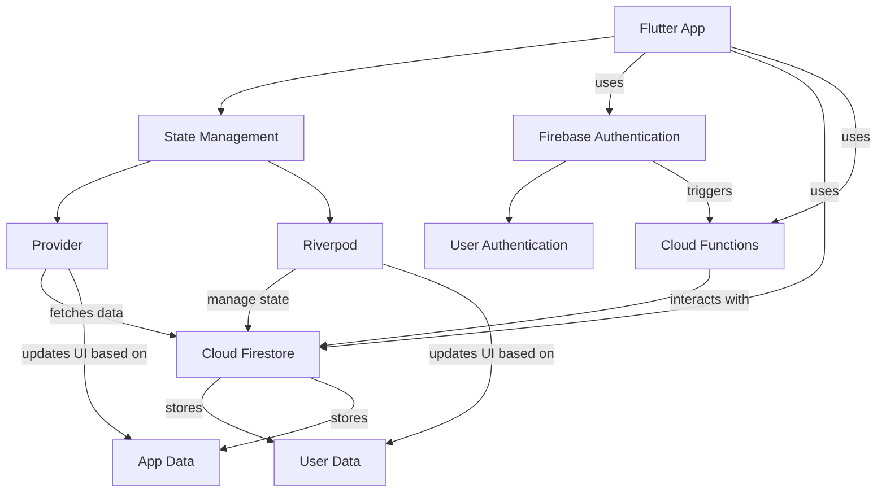

## Architecture Overview

This architecture overview shows the streamlined integration between various Flutter app layers and Firebase services, illustrating the state management techniques and the flow of data within the app.